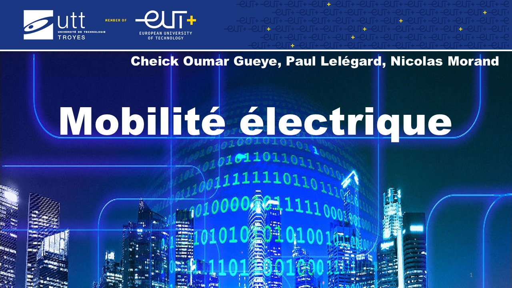

# Mobilite

Ce projet a été réalisé par 
    - Paul Lelégard
    - Cheick Oumar Gueye
    - Nicolas Morand
dans le cadre de la formation de mastère spécialisé "Big Data Engineer" de l'Université de Technologies de Troyes
Dans le cadre de ce projet, plusieurs sources de données ont été utilisées, puis traité et enfin analysées concernant la mobilité en France.

